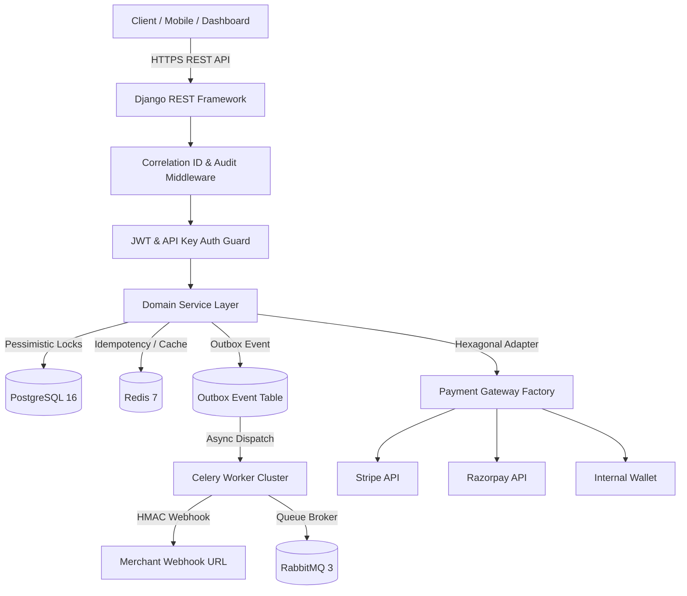
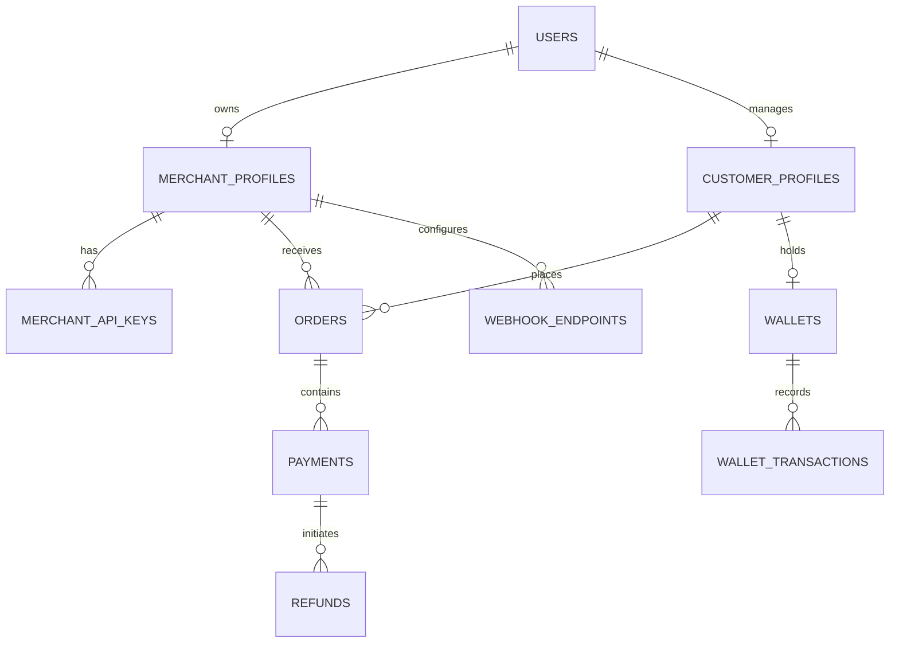
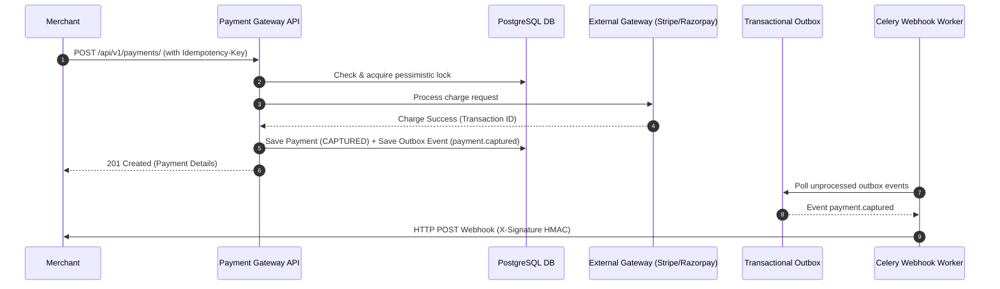
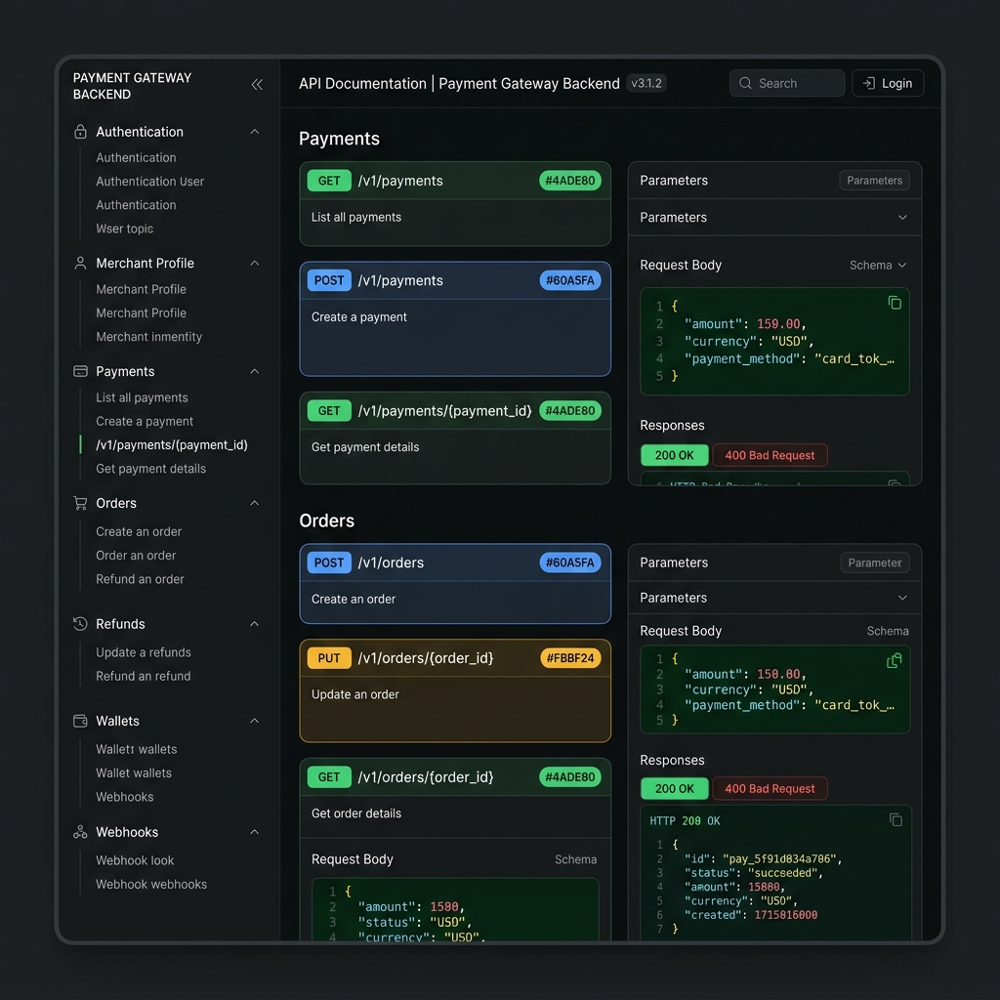
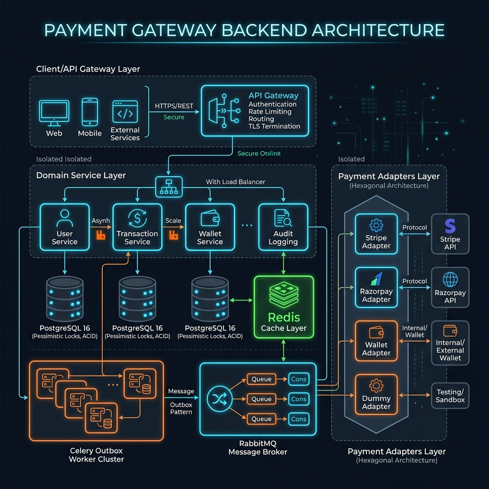
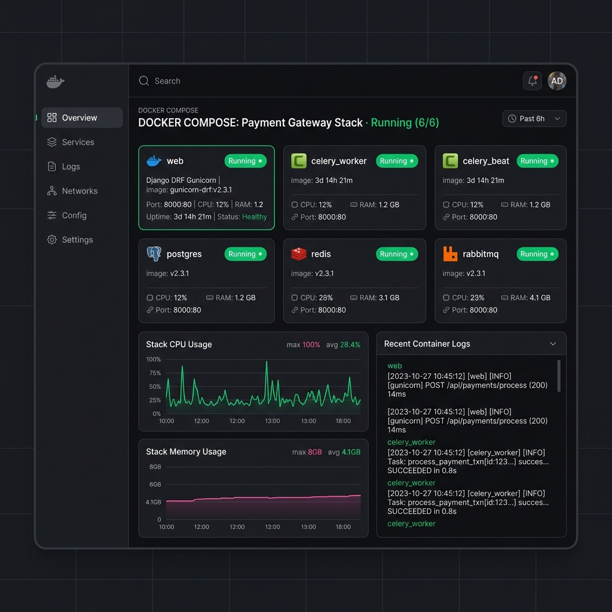

# Payment Gateway Backend

[](https://github.com/gaurav8299/Payment-Gateway-Backend/actions)
[](https://github.com/gaurav8299/Payment-Gateway-Backend)
[](https://www.python.org)
[](https://www.djangoproject.com)
[](https://www.docker.com)
[](LICENSE)
[](CHANGELOG.md)

An enterprise-grade, high-concurrency **Payment Gateway Backend** built with Django 5, Django REST Framework, PostgreSQL, Redis, Celery, and RabbitMQ. Engineered following **Clean Architecture**, **Domain-Driven Design (DDD)**, and **Hexagonal (Ports & Adapters)** principles to support multi-tenant merchant operations, atomic wallet ledgers, idempotent API requests, and transactional outbox webhooks.

---

## Key Features

- 🏛️ **Clean Architecture & SOLID**: Strict layer separation (`Presentation` -> `Service` -> `Repository` -> `Domain` -> `Adapters`).
- 🔐 **Auth & RBAC**: JWT token authentication with Blacklist invalidation, custom permissions for `ADMIN`, `MERCHANT`, and `CUSTOMER`.
- 💳 **Multi-Gateway Engine**: Polymorphic Hexagonal Adapters for Stripe, Razorpay, Wallet, and Dummy payment processors.
- 🔄 **Idempotency Guarantee**: Thread-safe Redis cache protection with `@idempotency_key_required` replay guard.
- ⚡ **Transactional Outbox & Webhooks**: Reliable webhook event publisher with HMAC-SHA256 signature verification and Celery exponential retry backoff.
- 👛 **Atomic Wallet Ledger**: High-concurrency balance transactions protected by `select_for_update()` pessimistic row locks.
- 📊 **Real-Time Analytics & Audit**: Merchant financial metrics (volume, success rate, refund rate) and immutable audit log tracing.
- 🛠️ **Developer Tooling**: Makefile commands, Postman & Insomnia collections, seed management command (`manage.py seed_data`), and complete `docs/` suite.

---

## 🏛️ System Architecture



---

## 📊 Database Entity Relationship Diagram (ERD)



---

## 🔄 Payment Lifecycle Sequence



---

## 🖼️ User Interface & Dashboard Previews

<div align="center">
  
  <p><em>Interactive OpenAPI 3.0 Documentation (Swagger UI)</em></p>
</div>

<br/>

<div align="center">
  
  <p><em>Clean Architecture & Hexagonal Adapter Components</em></p>
</div>

<br/>

<div align="center">
  
  <p><em>Docker Compose Orchestration (Web, Celery, Postgres, Redis, RabbitMQ)</em></p>
</div>

<br/>

<div align="center">
  
  <p><em>Comprehensive Pytest Coverage Report (112 Passed Tests)</em></p>
</div>

---

## 🚀 Quick Start Guide

### Option 1: Docker Compose (Recommended)

1. **Clone Repository**:
   ```bash
   git clone https://github.com/gaurav8299/Payment-Gateway-Backend.git
   cd Payment-Gateway-Backend
   ```

2. **Launch Services**:
   ```bash
   docker compose up -d --build
   ```

3. **Seed Demo Data**:
   ```bash
   docker compose exec web python manage.py seed_data
   ```

4. Access Interactive API Docs:
   - **Swagger UI**: [http://localhost:8000/api/docs/](http://localhost:8000/api/docs/)
   - **Redoc**: [http://localhost:8000/api/redoc/](http://localhost:8000/api/redoc/)

---

### Option 2: Local Developer Setup (Makefile)

1. **Install Dependencies**:
   ```bash
   python -m pip install --upgrade pip
   pip install -r requirements.txt
   ```

2. **Run Migrations & Seed**:
   ```bash
   make migrate
   make seed
   ```

3. **Start Development Server**:
   ```bash
   make run
   ```

4. **Run Code Quality & Test Suite**:
   ```bash
   make format
   make lint
   make test
   ```

---

## 📁 Repository Structure

```
.
├── apps/
│   ├── accounts/          # User management, Authentication & RBAC
│   ├── merchant/          # Merchant profiles, API Keys & Webhook endpoints
│   ├── customer/          # Customer CRM & Saved Payment Tokenization
│   ├── orders/            # Order creation & state machine
│   ├── payments/          # Payment engine & Hexagonal Gateway Adapters
│   ├── refunds/           # Refund engine & background retry queue
│   ├── wallet/            # Customer wallet & atomic balance ledger
│   ├── notifications/     # Notification dispatch services
│   ├── audit_logs/        # Immutable security audit logs
│   ├── webhooks/          # Transactional Outbox & HMAC delivery tasks
│   ├── analytics/         # Merchant financial dashboard aggregations
│   └── common/            # Shared base models, middleware, decorators, & commands
├── config/                # Modular Django settings (base, local, prod)
├── docs/                  # Detailed documentation suite (Architecture, API, Database, etc.)
├── tests/                 # Unit, Integration, & Concurrency Pytest suite
├── .github/               # Workflows (CI/CD), Issue Templates, PR Template, Dependabot
├── Makefile               # Shortcuts for common developer tasks
├── Dockerfile             # Multi-stage production container build
├── docker-compose.yml     # Multi-service container orchestration
├── postman_collection.json# Postman API Collection
└── insomnia_collection.json# Insomnia API Collection
```

---

## 📖 Complete Documentation Suite

For detailed technical guides, explore the [`docs/`](docs/) directory:

- 🏛️ [Architecture Guide](docs/architecture.md): Clean Architecture & Transactional Outbox pattern details.
- 📡 [API Specification](docs/api.md): Complete REST endpoint reference and request/response schemas.
- 🚀 [Deployment Guide](docs/deployment.md): Docker, Kubernetes, AWS, GCP, and Azure deployment procedures.
- 🗄️ [Database Reference](docs/database.md): Schema descriptions and entity relationships.
- ⚡ [Database Optimization](docs/database_optimization.md): Indexing strategy, query audits, and pessimistic lock analysis.
- 📝 [Logging Strategy](docs/logging.md): Correlation IDs, structured JSON logs, and data redaction.
- 📈 [Performance & Load Testing](docs/performance.md): Locust benchmarking scripts and SLAs.

---

## 📜 License & Community

- **License**: Released under the [MIT License](LICENSE).
- **Contributing**: Read our [Contributing Guidelines](CONTRIBUTING.md) before submitting a PR.
- **Code of Conduct**: We adhere to the [Contributor Code of Conduct](CODE_OF_CONDUCT.md).
- **Security**: Report security vulnerabilities safely following our [Security Policy](SECURITY.md).
